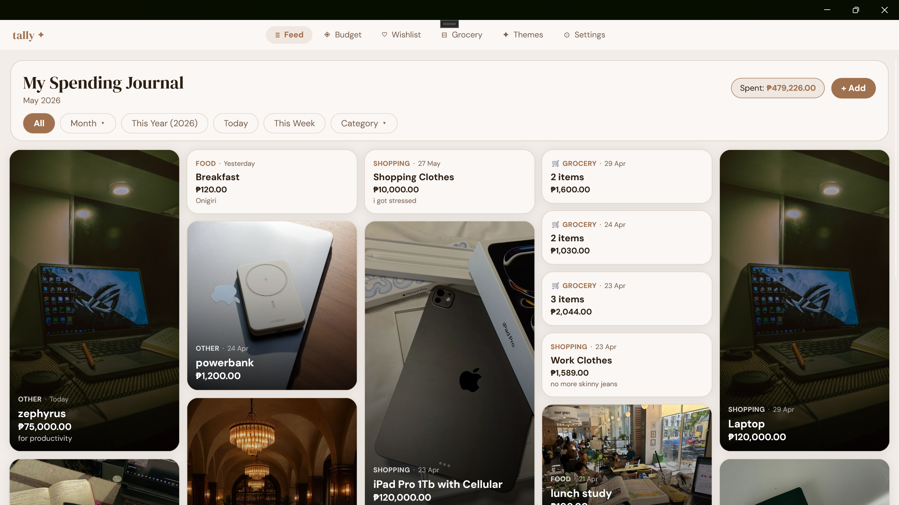

# Tally — Your Aesthetic Budget

**Because budgeting shouldn't feel like a chore.**

Tally is a personal finance app that refuses to look like one. It started as a course project, but it came from a real place of genuine frustration with finance apps and the sterile, clinical aesthetic they all seem to share. The goal here was simple: build something that actually looks worth opening. Tally combines a visual spending journal, category budgets, a grocery tracker, and a dream board, all wrapped in a multi-theme interface that feels like yours.

**Platform:** Windows Desktop (v1) · Android planned post-v1  
**Status:** Feature-complete MVP.

---

## Screenshots



---

## Features

### A spending journal that looks the part.
Your expenses live as cards in an adaptive masonry grid. Attach a photo and the card becomes full-bleed — image edge to edge, amount and category floating over a gradient. No photo? The card falls back to a clean, themed layout. The grid reflows from two to five columns as the window grows. Filter by all time, a specific month, or the current year.

### Photos, your way.
Attach an image from four sources: pick a file from disk, search Unsplash directly from inside the app, paste an image from the clipboard, or paste a URL. The Unsplash picker pulls live results and displays thumbnails inline — no modal, no browser detour.

### Budgets that tell you when to slow down.
Set a spending limit per category. Each card shows a live progress bar that goes red the moment you exceed it. Limits are nullable — leave a category uncapped if you don't need it. Edit inline without navigating anywhere.

### A grocery list with a brain.
Group-based grocery lists with estimated prices and quantities. A budget bar tracks how much of your grocery allowance is left, live, as you check items off. When you're done shopping, one tap converts all checked items into expenses and clears the list — each run lands as its own grouped card on the feed.

### A wish list that makes you think twice.
Priority tags (Need, Want, Someday), a cooling-off reminder that nudges you to wait seven days before buying, and a status flow from Planned to Bought. Bought items can log a regret rating. Pin your top item. Convert a wish directly into an expense when the moment finally comes.

### Six themes. Light and dark for each.
Clean Minimal, Sakura Bloom, Mocha Latte, Ocean Mist, Forest Dew, Midnight — and a custom palette picker if none of them are quite right. Every theme has a full light and dark variant, switchable from a segmented toggle on the Themes page. The entire app — chrome, cards, charts, tab bar — repaints instantly. No restart.

### Charts that follow the theme.
A donut chart and a bar chart on the Budget and Feed pages. Both are drawn natively via `Microsoft.Maui.Graphics` and re-theme themselves on every palette change. The bar chart preserves its layout space during hide/show transitions so nothing shifts around.

---

## Tech Stack

| Layer | Technology |
|---|---|
| UI framework | .NET MAUI (targeting `net10.0-windows`) |
| Language | C# |
| Architecture | MVVM with constructor-injected services |
| Database | SQLite via `sqlite-net-pcl` |
| ViewModel toolkit | `CommunityToolkit.Mvvm` (source generators) |
| HTTP | `IHttpClientFactory` via `AddHttpClient<T>()` |
| Fonts | DM Serif Display (headings) · DM Sans (body) · Phosphor Icons (glyphs) |
| Theme storage | `Microsoft.Maui.Storage.Preferences` |

---

## Project Structure

```
Tally_AestheticBudget/
├── Models/
│   ├── Entities.cs           # SQLite table definitions
│   ├── FeedModels.cs
│   ├── BudgetModels.cs
│   ├── GroceryModels.cs
│   ├── WishModels.cs
│   ├── UnsplashModels.cs
│   └── ThemeModels.cs        # ThemePalette, AppTheme, ThemeCardItem
├── ViewModels/
│   ├── FeedViewModel.cs
│   ├── AddExpenseViewModel.cs
│   ├── BudgetViewModel.cs
│   ├── GroceryViewModel.cs
│   ├── WishlistViewModel.cs
│   ├── ThemesViewModel.cs
│   └── SettingsViewModel.cs
├── Views/
│   ├── FeedPage.xaml / .cs
│   ├── AddExpensePage.xaml / .cs
│   ├── BudgetPage.xaml / .cs
│   ├── GroceryPage.xaml / .cs
│   ├── WishlistPage.xaml / .cs
│   ├── ThemesPage.xaml / .cs
│   └── SettingsPage.xaml / .cs
├── Services/
│   ├── DatabaseService.cs
│   ├── ExpenseService.cs       # IExpenseService
│   ├── BudgetService.cs        # IBudgetService
│   ├── GroceryService.cs       # IGroceryService
│   ├── WishService.cs          # IWishService
│   ├── ThemeService.cs         # IThemeService
│   ├── UnsplashService.cs      # IUnsplashService
│   ├── DataChangedService.cs   # Cross-ViewModel event bus
│   └── SettingsService.cs      # ISettingsService
├── Controls/
│   ├── DrawerHost.cs           # Non-modal slide-in panel
│   ├── DonutDrawable.cs        # GraphicsView donut chart
│   ├── BarDrawable.cs          # GraphicsView bar chart
│   ├── AspectLockedImage.cs
│   └── BlurOverlay.cs
├── Converters/
│   └── FeedConverters.cs
├── PhosphorIcons.cs            # Glyph codepoint constants
├── App.xaml / App.xaml.cs
├── AppShell.xaml / .cs
└── MauiProgram.cs              # DI registration
```

---

## Database Schema

Five SQLite tables, created on first launch and never dropped.

| Table | Purpose |
|---|---|
| `expenses` | All expense entries |
| `budgets` | Per-category spending limits (nullable via `-1` sentinel) |
| `grocery_groups` | Named grocery lists |
| `grocery_items` | Items within a grocery group |
| `wish_items` | Dream board entries |

The database lives in `FileSystem.AppDataDirectory` (`budget.db`). Theme and settings state is stored separately in `Preferences`, not SQLite.

---

## Architecture Notes

**Dependency injection** is configured in `MauiProgram.cs`. Services are singletons; ViewModels and Pages are transients. `UnsplashService` is registered via `AddHttpClient<T>()`, which wires it to the `IHttpClientFactory` without any additional HTTP package.

**Theme system** works by writing color values directly into `Application.Current.Resources` at runtime via `ThemeService.ApplyColorsToResources()`. No shell replacement happens on theme change — instead, pages call `RefreshThemeBoundBindings()` on every `OnAppearing` to ensure converter-bound properties re-fire even when the underlying bool hasn't changed. Each of the six preset themes carries a full `Light` and `Dark` `ThemePalette`; switching modes resolves the correct palette and re-applies through the same funnel.

**DrawerHost** is a custom `ContentView` that replaces modal overlays with a non-modal slide-in panel. Body and drawer live in a two-column grid; as the drawer expands, the Star-column body reflows into the remaining width. The page stays fully visible and interactive the whole time.

**Charts** (`DonutDrawable`, `BarDrawable`) are owned as ViewModel properties. They expose an `Invalidated` event; code-behind subscribes and calls `GraphicsView.Invalidate()` via `MainThread.BeginInvokeOnMainThread`. Theme colors are pushed in via `ApplyTheme(Color...)` using live values from the ResourceDictionary.

**DataChangedService** is a singleton event bus that carries typed change notifications (budget updated, expense added, etc.) so ViewModels never hold direct references to each other.

**Masonry grids** on Feed and Wishlist are constructed programmatically in code-behind. Layout logic that depends on measured widths does not belong in a ViewModel; the XAML files for those pages hold only a named container.

**Unsplash thumbnails** use `FlexLayout` + `BindableLayout` rather than `CollectionView` to avoid nested-`ScrollView` height negotiation failures on Windows.

---

## Getting Started

### Prerequisites

- Visual Studio 2022 or later (Windows)
- .NET 10 SDK
- .NET MAUI workload (`dotnet workload install maui`)
- Unsplash API key — copy `Secrets_template.cs` to `Secrets.cs` and fill in your key (the real file is gitignored)

### Run (Windows, unpackaged)

1. Clone the repo.
2. Open `Tally_AestheticBudget.sln` in Visual Studio.
3. Set the target to `Windows Machine`.
4. Press **F5**.

The SQLite database is created automatically on first launch. No migrations needed.

### NuGet packages

```
sqlite-net-pcl
SQLitePCLRaw.bundle_green
CommunityToolkit.Mvvm
```

These are already declared in the `.csproj`. A NuGet restore runs automatically on build.

---

## Theming

All color resources use semantic keys. Pages never reference hex values directly.

| Key | Role |
|---|---|
| `PageBackground` | Page and navigation background |
| `CardBackground` | Card and tab bar background |
| `CardBorder` | Card stroke |
| `TextPrimary` | Main text |
| `TextSecondary` | Subtitles and hints |
| `AccentColor` | Buttons, highlights, active states |
| `OnAccentColor` | Text and icons rendered on top of the accent |

The custom palette picker lets users set their own values for any of these. Custom palettes are mode-independent — only preset themes carry separate light and dark variants.

---

## Roadmap

- [ ] Google Drive backup — OAuth2-based manual export/restore to app-specific folder
- [ ] Recurring expenses
- [ ] Quantity deduction on grocery items
- [ ] Grocery photo and note before Buy Checked
- [ ] Per-month themes (requires `monthly_themes` DB table)
- [ ] More customization options on the Settings page
- [ ] Windows packaging (MSIX, `ExtendsContentIntoTitleBar`, title bar chrome)
- [ ] Android / mobile build (touch layout adjustments, smaller screen pass)

---

## Note

Initially built for a Software Project Management course. But the idea came from a real place — a genuine frustration with how every finance app on the market looks the same: clinical, cold, and uninviting. Tally was an attempt to fix that. Development continues past the semester.

---

## Team

| Name | Role |
|---|---|
| Le Bron Silang | Lead Architect & UI Engineer — system design, database, service layer, MVVM architecture, core feature implementation, and interactive UI systems (DrawerHost, charts, photo picker, theme engine) |
| Zoe Anasco | Lead Frontend Designer & Developer — visual identity, aesthetic direction, UI components, and design-side frontend development |
| Arielle Atim | Backend Contributor & QA — feature support and integration testing |